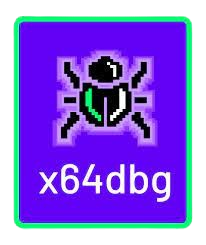

<h1 align="center">
    
    
    
    
</h1>

    
    
    
    
    
    
    
    
    
    
    
    
    
    

<h1 align="center">
     
    
    
     
</h1>

<h1 align="center">
     
    
     
</h1>

<h1 align="center">
    

        
    

    

        
    

     

        
    

</h1>

<h1 align="center">
    

        
        
        
        
    

</h1>

    Хочешь в игру, но ты просто не там

    

